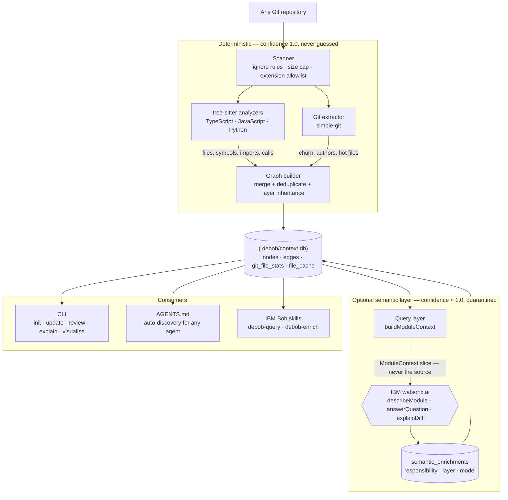

# DeBob

> Git remembers what changed. DeBob remembers what the codebase **means**.

DeBob is a persistent repository-understanding and context system for AI coding agents.

It scans any Git repository and builds `.debob/context.db` — a SQLite knowledge graph of files, symbols, imports, Git history, and optional LLM-inferred architectural context. AI agents query the graph instead of reading raw source files.

**The LLM never receives implementation source** — only a graph-derived slice: imports, exported symbols, the call graph, git churn, and the documentation comments the authors themselves wrote. DeBob measures this rather than asserting it. Enriching DeBob's own 46 modules sent **27,478 prompt tokens** (exact, reported by watsonx) against an estimated **~165,000** for the 0.63 MB of source it describes — a **~6.0× reduction**. Every run prints its own figure.

---

## Try It In 60 Seconds — No API Key Needed

This repository ships its own knowledge graph at `.debob/context.db`, already enriched by
watsonx.ai. You can explore it without an IBM Cloud account, a `.env` file, or any credentials:

```bash
git clone https://github.com/antiiiiny/DeBob.git
cd DeBob
npm install
npm run build
node dist/bin/debob.js visualise
```

That opens the interactive graph on `http://localhost:7842` — 299 nodes and 603 edges across 46
files, with watsonx-written responsibility summaries attached. Click any node with a cyan halo to
read its summary and see the model that produced it.


Nodes are coloured by type and sized by connectedness; regions are architectural layers. The node
inspector on the right shows what watsonx.ai wrote about the selected module, attributed to the
model that produced it.

Everything below is for pointing DeBob at a repository of your own.

---

## Using DeBob in a New Repository

### Step 1 — Build the graph

Run this once inside any Git repository:

```bash
node dist/bin/debob.js init
```

> **Windows / PowerShell note:** PowerShell blocks `.ps1` script shims, so `npx debob` may fail with a script execution policy error. Use `node dist/bin/debob.js <command>` directly, or prefix with `cmd /c "npx debob <command>"`.

This produces `.debob/context.db` and `.debob/manifest.json`. No credentials needed for the structural graph.

### Step 2 — Add LLM semantic enrichment (optional but recommended)

Create a `.env` file at the repository root:

```env
WATSONX_API_KEY=your_ibm_cloud_iam_api_key
WATSONX_PROJECT_ID=your_watsonx_project_id
WATSONX_URL=https://us-south.ml.cloud.ibm.com
WATSONX_MODEL_ID=meta-llama/llama-3-3-70b-instruct
```

Then run:

```bash
node dist/bin/debob.js init --semantic
```

This adds `responsibility` and architectural `layer` enrichments for every file node — stored in the `semantic_enrichments` table, never in the raw source.

Enrichment calls run concurrently (default 6 in flight, tune with `--concurrency <n>`).

**No watsonx credentials?** Your coding agent can do the same job — see [`enrich`](#enrich--semantic-enrichment-without-an-api-key) below.

### Step 3 — Explore the graph

```bash
node dist/bin/debob.js visualise
```

Opens an interactive Cytoscape.js graph in your browser. Filter by node type, layer, or hot-file status. Click any node to inspect its metadata.

### Step 4 — Keep it current

After making code changes, run an incremental update instead of a full re-init:

```bash
node dist/bin/debob.js update
```

Only files whose content has changed since the last run are re-analyzed. Unchanged files are skipped entirely.

### Step 5 — Ask a question

```bash
node dist/bin/debob.js explain "what does the scanner do?"
```

Answers free-form architecture/dependency/responsibility questions from the graph alone — never by reading raw source. Requires watsonx credentials. This is also what `debob init` teaches any AI coding agent to reach for automatically (see [How AI Agents Use DeBob](#how-ai-agents-use-debob) below) instead of grepping through files.

### Step 6 — Review a diff

Before committing or reviewing a PR, explain the architectural impact of your changes:

```bash
node dist/bin/debob.js review
```

Requires watsonx credentials. Reads the current `git diff HEAD`, maps changed files to their graph neighbourhood, and asks the LLM to explain risks and affected modules — without sending raw source code.

---

## Commands

### `init` — Build the knowledge graph

```bash
node dist/bin/debob.js init [options]
```

| Option | Description | Default |
|---|---|---|
| `--repo <path>` | Path to the repository root | current directory |
| `--max-commits <n>` | Maximum Git commits to analyze | `500` |
| `--semantic` | Run LLM enrichment after structural extraction | off |
| `--verbose` | Log each pipeline stage with counts | off |

**Output:**

```
✔ Repository analysis complete

─── DeBob Init Summary ──────────────────────────────────

  Files scanned : 35
  Nodes         : 158
  Edges         : 98
  Git commits   : 16

  Layer distribution (file nodes):
    business             17
    infra                15
    config               13
    data                 9
    presentation         2

  🔥 Hot files (top churn):
    bin/debob.ts (churn: 6.00)
    PROGRESS.md (churn: 9.00)

  External packages (20):
    commander, chalk, ora, open, simple-git … +15 more

  Database      : /your/repo/.debob/context.db

─────────────────────────────────────────────────────────
```

> The `layer distribution` shows only file nodes. Symbol nodes (functions, classes, etc.) and package nodes do not receive layer assignments — that is expected.

---

### `update` — Incremental re-analysis

```bash
node dist/bin/debob.js update [options]
```

Re-analyzes only files whose content hash has changed since the last `init` or `update`. Unchanged files are skipped — the graph is patched in-place.

| Option | Description | Default |
|---|---|---|
| `--repo <path>` | Path to the repository root | current directory |
| `--semantic` | Run LLM enrichment on re-analyzed files only | off |
| `--verbose` | List the re-analyzed files | off |

Requires `debob init` to have been run first. If the schema version has changed since `init`, `update` automatically falls back to a full `init`.

---

### `visualise` — Interactive graph browser

```bash
node dist/bin/debob.js visualise [options]
# alias: viz
```

Starts a local HTTP server and opens the graph in your browser (Cytoscape.js). Auto-retries ports 7842–7846 if the default is busy.

| Option | Description | Default |
|---|---|---|
| `--repo <path>` | Path to the repository root | current directory |
| `--port <n>` | HTTP port to listen on | `7842` |

**What you can do in the visualiser:**
- Filter nodes by type (file, class, function, interface, variable, package, route)
- Filter by architectural layer (business, data, presentation, config, infra, test)
- Toggle "hot files only" to show the highest-churn files
- Click any node to inspect its metadata: layer, confidence, churn score, author count, last modified

---

### `review` — Diff impact analysis

```bash
node dist/bin/debob.js review [options]
```

Reads a git diff, maps changed files to their graph nodes and 2-hop neighbourhood, then calls the LLM to explain which parts of the system are affected and what risks the change introduces.

| Option | Description | Default |
|---|---|---|
| `--repo <path>` | Path to the repository root | current directory |
| `--base <git-ref>` | Diff base ref (e.g. `main`, `HEAD~3`) | uncommitted changes vs HEAD |
| `--verbose` | Show detailed progress | off |

Requires watsonx credentials in `.env`. Exits with code 1 if no diff is found or the graph does not exist.

**Example:**

```bash
# Review uncommitted changes
node dist/bin/debob.js review

# Review everything since branching from main
node dist/bin/debob.js review --base main
```

---

### `enrich` — Semantic enrichment without an API key

```bash
node dist/bin/debob.js enrich --export .debob/enrichment.json
# your coding agent fills in the answers
node dist/bin/debob.js enrich --import .debob/enrichment-answers.json
```

Same result as `--semantic`, produced by the coding agent already running in your repo instead of a hosted model. `--export` writes each module's graph context (imports, exports, declarations, churn); the agent writes back `{ nodeId, responsibility, layer }` per module; `--import` validates and stores them in `semantic_enrichments`, propagates layers onto file nodes, and lets symbols inherit from their file.

| Option | Description |
|---|---|
| `--export <file>` | Write module contexts for an agent to fill in |
| `--import <file>` | Read agent-written answers into the graph |
| `--all` | Export every module, not just those with no responsibility yet |
| `--model <name>` | Recorded as the enrichment `modelId` (default `claude-code`) |
| `--repo <path>` | Repository root (default: cwd) |

`--export` skips already-enriched modules by default, so it's safe to re-run — it hands back only the outstanding work. Unknown `nodeId`s and invalid layers are reported under `Skipped` rather than silently dropped; a bad layer doesn't discard that module's responsibility.

Agents discover this automatically: `debob init` writes the workflow into your repo's `AGENTS.md`, and Bob-style agents can also read [`.bob/skills/debob-enrich/SKILL.md`](.bob/skills/debob-enrich/SKILL.md).

### `explain` — Ask a free-form question

```bash
node dist/bin/debob.js explain "<question>" [options]
```

Scores every graph node against the question by keyword overlap (path, name, type, layer, and cached `responsibility` enrichment text when available), assembles the top matches plus their edges, and asks the LLM to answer grounded in that slice — never raw source.

| Option | Description | Default |
|---|---|---|
| `--repo <path>` | Path to the repository root | current directory |
| `--verbose` | Show how many relevant nodes were found | off |

Requires watsonx credentials. Quote multi-word questions.

**Example:**

```bash
node dist/bin/debob.js explain "what does the persistence adapter do?"
node dist/bin/debob.js explain "which files are in the data layer?"
```

---

## IBM watsonx Credentials

Place these in a `.env` file at the repository root. The CLI loads it automatically at startup — no `export` needed.

```env
WATSONX_API_KEY=your_ibm_cloud_iam_api_key
WATSONX_PROJECT_ID=your_watsonx_project_id
WATSONX_URL=https://us-south.ml.cloud.ibm.com
WATSONX_MODEL_ID=meta-llama/llama-3-3-70b-instruct
```

| Variable | Description |
|---|---|
| `WATSONX_API_KEY` | IBM Cloud IAM API key |
| `WATSONX_PROJECT_ID` | watsonx.ai project ID |
| `WATSONX_URL` | Service URL for your region |
| `WATSONX_MODEL_ID` | Chat-capable model ID |

Available chat-capable models on `us-south`: `ibm/granite-4-h-small`, `meta-llama/llama-3-3-70b-instruct`, `mistralai/mistral-medium-2505`, `openai/gpt-oss-120b`.

Credentials are **never** written to `.debob/` or any config file. If any variable is missing when `--semantic` is used, DeBob warns and skips LLM enrichment — the structural graph is still built.

---

## What Gets Built

### `.debob/` directory

```
.debob/
├── context.db      # SQLite knowledge graph
└── manifest.json   # Run metadata (version, counts, timestamp, headCommit, semantic flag)
```

### `context.db` tables

| Table | Contents |
|---|---|
| `nodes` | Files, functions, classes, interfaces, variables, packages — with type, layer, confidence |
| `edges` | Imports, exports, extends, implements, calls relationships between nodes |
| `git_commits` | Commit history (hashed author emails — raw emails never stored) |
| `git_file_stats` | Per-file churn score, author count, last modified date |
| `file_cache` | Content hashes and analyzer versions — drives incremental updates |
| `semantic_enrichments` | LLM-inferred `responsibility` and `layer` per file node, with provider + model provenance |

### How it fits together



Static facts and model-inferred facts never mix: everything left of watsonx is reproducible with no
credentials, and model output is quarantined in its own table tagged with the provider and model
that produced it. Re-running `debob init` without `--semantic` never overwrites an enrichment.

See [`docs/architecture.md`](docs/architecture.md) for the full schema and design rationale, and
[`docs/pitch.html`](docs/pitch.html) — open it in a browser — for the measured case behind DeBob:
what actually reaches the model, how it compares to an agent reading the files, and every
before/after figure with its provenance.

### Language support

TypeScript/JavaScript (`.ts`/`.tsx`/`.js`/`.jsx`/`.mjs`/`.cjs`) is the full-depth V1 analyzer: imports, exports, functions, classes, interfaces, extends/implements. Python (`.py`) has a shallow analyzer: imports (including relative `from .foo import x`) and function/class nodes, no base-class edges. Both implement the same `LanguageAnalyzer` plugin interface — new languages are added by implementing it and registering an extension, no engine changes required.

### Sharing the graph with your team (optional)

`.debob/` is gitignored by default. If you'd rather the graph travel with the repo instead of staying local to one machine, remove the `.debob/` line from `.gitignore` and commit it. Tradeoff to know before you do: `context.db` is a single binary SQLite file, so two people running `debob update` on different branches will hit an unresolvable binary merge conflict, and repo history grows by a full DB copy on every commit that changes it. Works well with a single owner (or a CI job) regenerating it; less well with everyone updating it locally.

### Keeping it current automatically (optional)

A sample `git` hook is provided at [`githooks/post-commit`](githooks/post-commit) — it runs `debob update` in the background after every commit, without blocking or failing the commit. Opt in with:

```bash
git config core.hooksPath githooks
```

---

## How AI Agents Use DeBob

This is the actual point of DeBob: `debob init`/`debob update` doesn't just build the graph — it also writes a delimited block into the repository's root `AGENTS.md` (creating the file if it doesn't exist) so that **any** AI coding agent working in the repo discovers the graph automatically, not just DeBob's own tooling. The block tells the agent to prefer these commands over reading raw source for structural questions:

```bash
# Answer a free-form question, grounded in the graph
npx debob explain "what does src/engine/index.ts do?"
npx debob explain "what imports src/persistence/sqlite.ts?"
npx debob explain "which files are in the data layer?"

# Explain the impact of a diff
npx debob review [--base <ref>]
```

The block is idempotent — re-running `init`/`update` regenerates only the marked `<!-- DEBOB:START -->...<!-- DEBOB:END -->` region, never touching the rest of a hand-written `AGENTS.md`.

For advanced or raw graph queries the CLI doesn't cover, the Bob skill at [`.bob/skills/debob-query/SKILL.md`](.bob/skills/debob-query/SKILL.md) documents the underlying SQL/TypeScript query patterns directly (e.g. `filter edges WHERE target = X AND type = 'imports'`) — useful for one-off exploration, but `debob explain`/`debob review` are the primary interface: any agent with shell access can use them without knowing anything about DeBob's internals.

---

## Contributing

```bash
npm run typecheck   # tsc --noEmit — must pass before any commit
npm run build       # tsup → dist/
npm run dev         # tsx bin/debob.ts — run CLI in dev mode (no build needed)
```

See [`AGENTS.md`](.bob/rules-agent/AGENTS.md) for the full coding guide: dependency constraints, WASM pinning, sql.js patterns, ID conventions.

---

*Built with [IBM Bob](https://ibm.com)*
