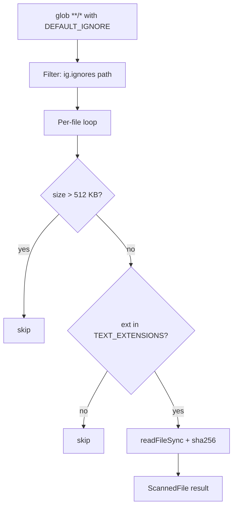

# Likely bug waiting to happen — scanning needs to respect .gitignore
Nothing in the plan currently excludes node_modules, dist, .git, build artifacts, etc. from the scanner. If it walks everything, your node/edge counts balloon into the tens of thousands on any real repo, tree-sitter parsing gets slow, and your demo either hangs or produces a nonsense-looking graph full of vendored code. This is worth fixing before Sub-task 7, not after — cheap to add now (just diff against .gitignore patterns, or hardcode common excludes as a fallback), expensive to debug later once the graph builder depends on scanner output.

---

**Status:** active  **Date:** 2026-08-28

---

### 👤 User

Likely bug waiting to happen — scanning needs to respect .gitignore
Nothing in the plan currently excludes node_modules, dist, .git, build artifacts, etc. from the scanner. If it walks everything, your node/edge counts balloon into the tens of thousands on any real repo, tree-sitter parsing gets slow, and your demo either hangs or produces a nonsense-looking graph full of vendored code. This is worth fixing before Sub-task 7, not after — cheap to add now (just diff against .gitignore patterns, or hardcode common excludes as a fallback), expensive to debug later once the graph builder depends on scanner output.

---

### 🤖 Assistant

> 🔧 called: use_skill


> 🔧 **use_skill** — create-plan

### 🤖 Assistant

> 🔧 called: spawn_subagent

Let me research the codebase to understand the current scanner implementation before asking any questions.

> 🔧 **spawn_subagent** — explore

### 🤖 Assistant

> 🔧 called: read_file, read_file, read_file

Good — now I have a clear picture. Let me also check the existing plan file and how `.debobignore` is currently referenced.

> 🔧 **read_file** — .debobignore

> 🔧 **read_file** — debob-plan.md

> 🔧 **read_file** — debob-plan.md

### 🤖 Assistant

> 🔧 called: ask_followup_question, ask_followup_question

Now I have everything I need. The picture is clear:

**Current state:** The scanner at [`src/scanner/index.ts`](src/scanner/index.ts) already has a solid `DEFAULT_IGNORE` list and a `dot: false` glob option. It also already has an `extraIgnore` escape hatch on `ScanOptions`. What it's missing is **respecting the project's own `.gitignore`** (and `.debobignore`) so that project-specific exclusions (e.g. custom `build/`, `*.log`, `_test_*.ts` scratch files) are honoured automatically.

The `glob` package v10 supports an `ignore` option that takes an array of patterns — but it does **not** natively read `.gitignore` files. To wire in `.gitignore` support, we'd need either:
1. The [`ignore`](https://www.npmjs.com/package/ignore) npm package (lightweight, zero-dep gitignore-spec parser), or  
2. Switching to `fast-glob` + `ignore`, or  
3. Reading `.gitignore` ourselves and converting its rules into glob patterns passed to the existing `ignore` array.

Let me confirm the design intent before writing the plan:

### 🤖 Assistant

I've read the scanner. It already excludes `node_modules`, `.git`, `dist`, `build`, etc. via hardcoded `DEFAULT_IGNORE` patterns. What it doesn't do is read `.gitignore` (or `.debobignore`) to honour project-specific exclusions like custom output dirs, scratch files, etc.

There are two sensible approaches for wiring in `.gitignore` support — which do you prefer?

> 🔧 **ask_followup_question** — I've read the scanner. It already excludes `node_modules`, `.git`, `dist`, `build`, etc. via hardcoded `DEFAULT_IGNORE` patterns. What it doesn't do is read `.gitignore` (or `.debobignore`) to honour project-specific exclusions like custom output dirs, scratch files, etc.

There are two sensible approaches for wiring in `.gitignore` support — which do you prefer?

### 🤖 Assistant

One more scoping question: should the `.gitignore` + `.debobignore` reading be limited to the repo root only, or should it walk nested directories (like `git` does — each subdirectory can have its own `.gitignore`)?

> 🔧 **ask_followup_question** — One more scoping question: should the `.gitignore` + `.debobignore` reading be limited to the repo root only, or should it walk nested directories (like `git` does — each subdirectory can have its own `.gitignore`)?

---

### 👤 User

Binary/huge-file handling
Related: contentHash and tree-sitter parsing both assume text source. A stray binary or a massive generated file (lockfiles, minified bundles) could either crash the analyzer or produce garbage nodes. A simple size cap + extension allowlist on the scanner side avoids this.

---

### 🤖 Assistant

> 🔧 called: read_file, read_file

Let me gather the remaining context I need before writing the plan.

> 🔧 **read_file** — debob-plan.md

> 🔧 **read_file** — src/scanner/index.ts

### 🤖 Assistant

> 🔧 called: glob, read_file, glob, list_files

Now let me check if there's an existing scanner test file and the `package.json` to understand the current test setup and installed packages:

> 🔧 **read_file** — package.json

> 🔧 **glob** — src/scanner/**

> 🔧 **glob** — src/**/*.ts

> 🔧 **list_files** — src

### 🤖 Assistant

> 🔧 called: write_file

I have everything I need. Now I have a complete picture of both issues. Let me write the plan.

Here's my understanding before I write it:

**Issue 1 — `.gitignore` / `.debobignore` respect:**  
The scanner uses hardcoded `DEFAULT_IGNORE` globs but never reads `.gitignore` or `.debobignore`. The `ignore` npm package is the right tool (de-facto gitignore-spec parser, already used by `eslint`, `prettier`, etc.). We add it as a dependency, read both files at scan time, and post-filter the glob results through the ignore instance — no change to the glob call itself.

**Issue 2 — Binary/huge-file safety:**  
The scanner reads every file into a `Buffer` and feeds it to `sha256()`, then the analyzer receives the raw content string. Two protections needed:
1. **Size cap** — skip files over a configurable threshold (e.g. 512 KB) before calling `readFileSync`
2. **Extension allowlist** — only hash/analyze files whose extension is in a known-text set; skip everything else (images, fonts, zip, wasm, lock files, etc.)

Both fixes live entirely inside [`src/scanner/index.ts`](src/scanner/index.ts) and [`src/scanner/types.ts`](src/scanner/types.ts). No downstream consumers change — `ScannedFile` shape stays the same; files that fail either guard are simply not returned.

> 🔧 **write_file** — scanner-hardening-plan.md

### 🤖 Assistant

Plan written at [`scanner-hardening-plan.md`](scanner-hardening-plan.md). Here's the summary:

---

## What the plan covers

Two independent, same-file changes to [`src/scanner/index.ts`](src/scanner/index.ts):



### Sub-Task A — `.gitignore` / `.debobignore` respect
- Add the `ignore` npm package (gitignore-spec parser)
- After the glob call, read both ignore files from `repoRoot`, build one `ig` instance, post-filter the path list
- `ScanOptions` gains `respectGitignore?: boolean` (default `true`) as an opt-out for tests
- `DEFAULT_IGNORE` stays as-is — it prunes directories before globbing, which is faster

### Sub-Task B — Binary / huge-file safety
- Add a `MAX_FILE_BYTES = 512 * 1024` constant — skip files over this before `readFileSync`
- Add a `TEXT_EXTENSIONS` allowlist (all known source/config text extensions) — skip files whose extension isn't on it
- Both checks sit inside the existing per-file loop, right after `statSync`, before any read

**Only `src/scanner/index.ts` and `package.json` change.** No type changes, no API breaks, no downstream consumers affected.

---

A few things to confirm before implementing:

1. **512 KB size cap** — does that feel right, or would you prefer a different threshold? (e.g. 256 KB is more aggressive, 1 MB is more permissive)
2. **`TEXT_EXTENSIONS` scope** — I've included non-JS/TS formats like `.json`, `.yaml`, `.sql`, `.vue`, etc. These pass the guard and land in `ScannedFile[]` with `language: "unknown"` — the engine records them in `file_cache` but no analyzer touches them. Should non-JS/TS formats be excluded at the extension-allowlist level instead, so they never appear in results at all?
3. **Sub-Tasks A and B together in one commit** — any reason to split them?

---

### 👤 User

1. lets do 1mb2. dont exclude those for now, these might be needed sometimes to link as a database in the graph, maybe represent it differently, keep it as it is for now.3. do it in one

---

### 🤖 Assistant

> 🔧 called: update_todo_list


> 🔧 **update_todo_list** — 
[-] Implement Sub-Task A (gitignore respect) + Sub-Task B (binary/huge-file safety) together in one commit
[ ] Run tsc --noEmit to confirm no type errors
[ ] Update scanner-hardening-plan.md sub-task statuses


### 🤖 Assistant

> 🔧 called: execute_command

First, install the `ignore` package:

> 🔧 **execute_command** — npm install ignore@^5.3.2

### 🤖 Assistant

> 🔧 called: execute_command

Good. Now check the exact type signature for the `ignore` package:

> 🔧 **execute_command** — Get-Content node_modules\ignore\index.d.ts | Select-Object -First 40

### 🤖 Assistant

> 🔧 called: apply_diff

Now apply all changes to `src/scanner/index.ts` in one go:

> 🔧 **apply_diff** — src/scanner/index.ts

### 🤖 Assistant

> 🔧 called: execute_command

Now typecheck:

> 🔧 **execute_command** — npx tsc --noEmit 2>&1

### 🤖 Assistant

> 🔧 called: apply_diff, update_todo_list

Clean. Now update the plan file to mark both sub-tasks done and correct the 1 MB threshold:

> 🔧 **apply_diff** — scanner-hardening-plan.md

> 🔧 **update_todo_list** — 
[x] Implement Sub-Task A (gitignore respect) + Sub-Task B (binary/huge-file safety) together in one commit
[x] Run tsc --noEmit to confirm no type errors
[x] Update scanner-hardening-plan.md sub-task statuses


### 🤖 Assistant

Done. Here's what landed in [`src/scanner/index.ts`](src/scanner/index.ts):

---

**Sub-Task A — `.gitignore` / `.debobignore` respect**
- Added `ignore` npm package (v5.3.2)
- After globbing, reads both ignore files from `repoRoot` via [`tryReadText()`](src/scanner/index.ts) (missing files silently produce `""`)
- Builds one `ignore` instance and applies it as a post-glob filter — only activates if at least one file had content, so there's zero overhead on repos with neither file
- `ScanOptions` gains `respectGitignore?: boolean` (default `true`); set to `false` in tests that scan temp dirs with no ignore files

**Sub-Task B — Binary / huge-file safety**
- `MAX_FILE_BYTES = 1 * 1024 * 1024` — files over 1 MB are skipped before `readFileSync`
- `TEXT_EXTENSIONS` set (37 extensions) — files whose extension isn't on the list are skipped before `statSync` is even called
- Guard order is cheapest-first: extension check (no I/O) → `statSync` + size check → `readFileSync`
- `ScannedFile` interface and all downstream consumers are unchanged

---

### 👤 User

Ok can we update progress.md and debob-plan.md and make sure everything is updated

---

### 🤖 Assistant

> 🔧 called: read_file, read_file

Let me read both files first to understand their current state.

> 🔧 **read_file** — PROGRESS.md

> 🔧 **read_file** — debob-plan.md

### 🤖 Assistant

> 🔧 called: apply_diff

Now I have a clear picture of what needs updating. The Sub-Task 4 entry in `debob-plan.md` needs its outcomes and context updated to reflect the hardening changes, and `PROGRESS.md` needs the scanner entry updated plus the new `ignore` dependency noted, the `scanner-hardening-plan.md` file listed, and the "What NOT to do" / key notes updated.

> 🔧 **apply_diff** — debob-plan.md

### 🤖 Assistant

> 🔧 called: apply_diff

Now update `PROGRESS.md` — the status table, file inventory, dependency table, and key notes all need touching:

> 🔧 **apply_diff** — <<<<<<< SEARCH
:start_line:27
-------
| Concern | Choice |
|---|---|
| Language | TypeScript + Node.js (ESM) |
| Build | `tsup` → `dist/` |
| Dev runner | `tsx` |
| SQLite | `sql.js` (WASM — no native build needed) |
| AST parsing | `web-tree-sitter@0.22.6` + `tree-sitter-wasms@0.1.13` (WASM) |
| Git | `simple-git` |
| CLI | `commander` |
| LLM (V1) | IBM watsonx REST API (provider-agnostic adapter) |
=======
| Concern | Choice |
|---|---|
| Language | TypeScript + Node.js (ESM) |
| Build | `tsup` → `dist/` |
| Dev runner | `tsx` |
| SQLite | `sql.js` (WASM — no native build needed) |
| AST parsing | `web-tree-sitter@0.22.6` + `tree-sitter-wasms@0.1.13` (WASM) |
| Git | `simple-git` |
| CLI | `commander` |
| Ignore rules | `ignore@^5.3.2` (gitignore-spec parser — used by scanner) |
| LLM (V1) | IBM watsonx REST API (provider-agnostic adapter) |
>>>>>>> REPLACE

<<<<<<< SEARCH
:start_line:49
-------
| # | Sub-task | Status |
|---|---|---|
| 1 | Project Scaffold | ✅ done |
| 2 | Shared Types | ✅ done |
| 3 | SQLite Persistence Layer | ✅ done |
| 4 | Repository Scanner | ✅ done |
| 5 | TypeScript/JS Static Analyzer | ✅ done |
| 6 | Git Metadata Extractor | ✅ done |
| 7 | Graph Builder | ⬜ pending — **NEXT** |
| 8 | Core Engine Orchestrator | ⬜ pending |
| 9 | CLI Entry Point | ⬜ pending |
| 10 | LLM Adapter + watsonx + Context Builder | ⬜ pending |
| 11 | Architecture Documentation | ⬜ pending |
=======
| # | Sub-task | Status |
|---|---|---|
| 1 | Project Scaffold | ✅ done |
| 2 | Shared Types | ✅ done |
| 3 | SQLite Persistence Layer | ✅ done |
| 4 | Repository Scanner | ✅ done (+ hardening: gitignore, size cap, extension allowlist) |
| 5 | TypeScript/JS Static Analyzer | ✅ done |
| 6 | Git Metadata Extractor | ✅ done |
| 7 | Graph Builder | ⬜ pending — **NEXT** |
| 8 | Core Engine Orchestrator | ⬜ pending |
| 9 | CLI Entry Point | ⬜ pending |
| 10 | LLM Adapter + watsonx + Context Builder | ⬜ pending |
| 11 | Architecture Documentation | ⬜ pending |
>>>>>>> REPLACE

<<<<<<< SEARCH
:start_line:66
-------
## Complete File Inventory

```
.gitignore                          ← dist/, node_modules/, .debob/, .env, bob_sessions/,
                                       _test_*.mjs, _test_*.ts, _scratch_*.mjs
.bobignore
package.json                        ← debob 0.1.0, ESM, bin: dist/bin/debob.js
                                       web-tree-sitter pinned to EXACT "0.22.6"
tsconfig.json                       ← ES2022, moduleResolution: bundler, strict
tsup.config.ts                      ← entry: bin/debob.ts + src/**, format: esm
README.md                           ← quick-start, commands, watsonx env vars
debob-plan.md                       ← full architecture plan + all sub-task specs
PROGRESS.md                         ← this file

bin/
  debob.ts                          ← CLI scaffold placeholder (full impl: Sub-Task 9)

src/
  types/
    index.ts                        ← central re-export barrel for all shared types

  graph/
    types.ts                        ← NodeType, EdgeType, DataSource, ArchitecturalLayer,
                                       Node, Edge, Graph

  analyzers/
    interface.ts                    ← LanguageAnalyzer, AnalysisResult plugin interface
    typescript/
      index.ts                      ← TypeScriptAnalyzer (web-tree-sitter WASM)
                                       IMPORTANT: uses 'import_statement' node type
                                       (NOT 'import_declaration' — tree-sitter grammar quirk)

  git/
    index.ts                        ← extractGitMetadata(), GitCommit, GitFileStats, GitMetadata
                                       SHA-256 hashes author emails; returns gracefully if not a repo

  persistence/
    interface.ts                    ← PersistenceAdapter interface, FileCacheEntry,
                                       SemanticEnrichment, GitCommit, GitFileStats, GitMetadata
    schema.ts                       ← SCHEMA_VERSION=1, CREATE TABLE DDL for 6 tables + indexes
    sqlite.ts                       ← SqlitePersistenceAdapter, openDb, saveDb,
                                       writeManifest, readManifest
    index.ts                        ← re-exports SCHEMA_VERSION, PersistenceAdapter,
                                       SqlitePersistenceAdapter, openDb, writeManifest, readManifest

  scanner/
    types.ts                        ← ScannedFile interface
    index.ts                        ← scanRepository(), summarizeByLanguage(), ScanOptions

  llm/
    adapter.ts                      ← LLMAdapter interface, LLMConfig, ModuleContext,
                                       DiffContext, QueryContext (interfaces only — impl: Sub-Task 10)
    providers/                      ← (empty — watsonx impl: Sub-Task 10)

  engine/                           ← (empty — Sub-Task 8)
  query/                            ← (empty — Sub-Task 10)

docs/                               ← (empty — Sub-Task 11)
```
=======
## Complete File Inventory

```
.gitignore                          ← dist/, node_modules/, .debob/, .env, bob_sessions/,
                                       _test_*.mjs, _test_*.ts, _scratch_*.mjs
.debobignore                        ← user-facing debob-specific ignore file (gitignore syntax)
package.json                        ← debob 0.1.0, ESM, bin: dist/bin/debob.js
                                       web-tree-sitter pinned to EXACT "0.22.6"
                                       ignore@^5.3.2 added for scanner gitignore support
tsconfig.json                       ← ES2022, moduleResolution: bundler, strict
tsup.config.ts                      ← entry: bin/debob.ts + src/**, format: esm
README.md                           ← quick-start, commands, watsonx env vars
debob-plan.md                       ← full architecture plan + all sub-task specs
scanner-hardening-plan.md           ← completed plan: gitignore respect + binary/huge-file guards
PROGRESS.md                         ← this file

bin/
  debob.ts                          ← CLI scaffold placeholder (full impl: Sub-Task 9)

src/
  types/
    index.ts                        ← central re-export barrel for all shared types

  graph/
    types.ts                        ← NodeType, EdgeType, DataSource, ArchitecturalLayer,
                                       Node, Edge, Graph

  analyzers/
    interface.ts                    ← LanguageAnalyzer, AnalysisResult plugin interface
    typescript/
      index.ts                      ← TypeScriptAnalyzer (web-tree-sitter WASM)
                                       IMPORTANT: uses 'import_statement' node type
                                       (NOT 'import_declaration' — tree-sitter grammar quirk)

  git/
    index.ts                        ← extractGitMetadata(), GitCommit, GitFileStats, GitMetadata
                                       SHA-256 hashes author emails; returns gracefully if not a repo

  persistence/
    interface.ts                    ← PersistenceAdapter interface, FileCacheEntry,
                                       SemanticEnrichment, GitCommit, GitFileStats, GitMetadata
    schema.ts                       ← SCHEMA_VERSION=1, CREATE TABLE DDL for 6 tables + indexes
    sqlite.ts                       ← SqlitePersistenceAdapter, openDb, saveDb,
                                       writeManifest, readManifest
    index.ts                        ← re-exports SCHEMA_VERSION, PersistenceAdapter,
                                       SqlitePersistenceAdapter, openDb, writeManifest, readManifest

  scanner/
    types.ts                        ← ScannedFile interface
    index.ts                        ← scanRepository(), summarizeByLanguage(), ScanOptions
                                       DEFAULT_IGNORE globs, TEXT_EXTENSIONS allowlist,
                                       MAX_FILE_BYTES (1 MB) cap, .gitignore/.debobignore filter

  llm/
    adapter.ts                      ← LLMAdapter interface, LLMConfig, ModuleContext,
                                       DiffContext, QueryContext (interfaces only — impl: Sub-Task 10)
    providers/                      ← (empty — watsonx impl: Sub-Task 10)

  engine/                           ← (empty — Sub-Task 8)
  query/                            ← (empty — Sub-Task 10)

docs/                               ← (empty — Sub-Task 11)
```
>>>>>>> REPLACE

<<<<<<< SEARCH
:start_line:127
-------
## Key Implementation Notes

### WASM ABI Compatibility (CRITICAL)
=======
## Key Implementation Notes

### Scanner Exclusion Behaviour
- Files are excluded by **four layered guards** in cheapest-first order:
  1. `DEFAULT_IGNORE` + `extraIgnore` glob patterns — applied by `glob` before any file I/O
  2. `.gitignore` / `.debobignore` post-filter — via `ignore` package (`respectGitignore: true` by default)
  3. `TEXT_EXTENSIONS` allowlist — extension not in set → skip (no `statSync` call)
  4. `MAX_FILE_BYTES` (1 MB) size cap — checked after `statSync`, before `readFileSync`
- To disable gitignore filtering in tests: `scanRepository(root, { respectGitignore: false })`
- `.debobignore` uses standard gitignore syntax; ship it empty, users add project-specific rules

### WASM ABI Compatibility (CRITICAL)
>>>>>>> REPLACE


### 🤖 Assistant

> 🔧 called: execute_command

One final typecheck to make sure nothing drifted:

> 🔧 **execute_command** — npx tsc --noEmit 2>&1

### 🤖 Assistant

All clean. Here's a summary of every change made:

---

### `debob-plan.md` — Sub-Task 4 updated
- Signature updated to show `options?: ScanOptions`
- Three new **Expected Outcomes** added (gitignore, size cap, extension allowlist)
- Three new **Todo List** items (7–9) marked ✓
- **Relevant Context** expanded with `respectGitignore`, `extraIgnore`, guard order, and `ignore` package version
- Status note points to `scanner-hardening-plan.md`

### `PROGRESS.md` — four sections updated
- **Technology Stack table** — `ignore@^5.3.2` row added
- **Sub-Task status table** — Sub-Task 4 annotated with the hardening work
- **File Inventory** — `.bobignore` corrected to `.debobignore`, `scanner-hardening-plan.md` listed, `package.json` note updated, `scanner/index.ts` description expanded
- **Key Implementation Notes** — new **Scanner Exclusion Behaviour** section added describing all four guards in order, the opt-out flag, and `.debobignore` syntax