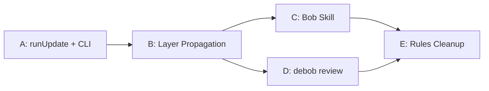

# Read debob-next-plan.md I’ve traced the codebase: runInit owns scan → AST → Git → graph → persistence → optional enrichment; SQL persistence is deliberately behind SqlitePersistenceAdapter; the CLI currently has only an init path plus a stub review. I also found the rule files are substantially stale, matching the plan’s diagnosis. I’ll establish the baseline now, then begin incremental update support.


Edited files, ran commands


You've hit your usage limit. Upgrade your plan to continue, or try again at Sep 27, 2026, 11:54 PM.


Edited 4 files+293-19Review changesUndoReview

src/engine/index.tssrc/engine/index.ts+182-19
src/git/index.tssrc/git/index.ts+6-0
src/persistence/interface.tssrc/persistence/interface.ts+14-0
src/persistence/sqlite.tssrc/persistence/sqlite.ts+91-0

---

**Status:** error  **Date:** 2026-08-29

---

### 👤 User

Read debob-next-plan.md I’ve traced the codebase: runInit owns scan → AST → Git → graph → persistence → optional enrichment; SQL persistence is deliberately behind SqlitePersistenceAdapter; the CLI currently has only an init path plus a stub review. I also found the rule files are substantially stale, matching the plan’s diagnosis. I’ll establish the baseline now, then begin incremental update support.


Edited files, ran commands


You've hit your usage limit. Upgrade your plan to continue, or try again at Sep 27, 2026, 11:54 PM.


Edited 4 files+293-19Review changesUndoReview

src/engine/index.tssrc/engine/index.ts+182-19
src/git/index.tssrc/git/index.ts+6-0
src/persistence/interface.tssrc/persistence/interface.ts+14-0
src/persistence/sqlite.tssrc/persistence/sqlite.ts+91-0

---

### 🤖 Assistant

> 🔧 called: use_skill


> 🔧 **use_skill** — create-plan

### 🤖 Assistant

> 🔧 called: read_file

Let me read the plan file and the modified source files to understand what's been done and what comes next.

> 🔧 **read_file** — debob-next-plan.md

### 🤖 Assistant

> 🔧 called: read_file, read_file, read_file, read_file

Now let me read the modified source files to understand what baseline changes were made:

> 🔧 **read_file** — src/engine/index.ts

> 🔧 **read_file** — src/persistence/interface.ts

> 🔧 **read_file** — src/persistence/sqlite.ts

> 🔧 **read_file** — src/git/index.ts

### 🤖 Assistant

> 🔧 called: read_file, read_file

Now let me check what's in the engine and CLI, and what the current state of the types barrel and the bin file look like:

> 🔧 **read_file** — src/types/index.ts

> 🔧 **read_file** — bin/debob.ts

### 🤖 Assistant

> 🔧 called: read_file

Now I have a complete picture. Let me understand exactly what the recent edits established and what remains to be done:

> 🔧 **read_file** — PROGRESS.md

### 🤖 Assistant

> 🔧 called: write_file

Now I have the full picture. The recent edits have established a solid baseline for Sub-Task A. Let me assess exactly what was done vs. what still needs implementing:

**What the recent edits added (the "baseline"):**
1. **`src/engine/index.ts`** — Added `UpdateOptions`/`UpdateResult` types, plus helper functions: `makeFileNode`, `makeStubNode`, `applyFileMetadata`, `mergeAnalysisResults`, `removeUnreferencedPackages`, `markHotFiles`, `mergeGitFileStats`, `countChangedEntries` — but **`runUpdate` itself is not yet implemented**
2. **`src/persistence/interface.ts`** — Added delete/read methods to `PersistenceAdapter` and `headCommit` to `GitMetadata`
3. **`src/persistence/sqlite.ts`** — Implemented all delete/read methods, added `headCommit?` to `Manifest`, added `readGitFileStats()`, `readSemanticEnrichments()`
4. **`src/git/index.ts`** — Added `fromCommit?` to `GitExtractOptions`, wired it into the log command

**What still needs to happen for Sub-Task A:**
- `runUpdate` function body in `src/engine/index.ts`
- `update` command in `bin/debob.ts`
- Export `UpdateResult`/`UpdateOptions` in `src/types/index.ts`
- `headCommit` written into the manifest in `runInit`

**Sub-Tasks B, C, D, E** remain fully pending.

Now I can write the plan file. Let me create it:

> 🔧 **write_file** — debob-impl-plan.md

### 🤖 Assistant

Here's where things stand and what the plan covers:

---

## What the Recent Baseline Edits Established

The 4-file edit (+293/-19) was **scaffolding only** — no `runUpdate` function body yet:

| File | What was added |
|---|---|
| [`src/engine/index.ts`](src/engine/index.ts) | `UpdateOptions`/`UpdateResult` types + 7 helper functions (`makeFileNode`, `mergeAnalysisResults`, `markHotFiles`, `mergeGitFileStats`, etc.) |
| [`src/persistence/interface.ts`](src/persistence/interface.ts) | Delete/read methods on `PersistenceAdapter`; `headCommit` on `GitMetadata` |
| [`src/persistence/sqlite.ts`](src/persistence/sqlite.ts) | All 9 new adapter methods fully implemented; `headCommit?` on `Manifest` |
| [`src/git/index.ts`](src/git/index.ts) | `fromCommit?` option on `GitExtractOptions`, wired into the log range |

---

## Plan: [`debob-impl-plan.md`](debob-impl-plan.md)

Five sub-tasks, in order:



### Sub-Task A — `runUpdate` + `debob update` CLI
The helpers are all written. What remains: implement the `runUpdate` function body, add `headCommit` to the manifest in `runInit`, wire the `update` command in [`bin/debob.ts`](bin/debob.ts), and export types from [`src/types/index.ts`](src/types/index.ts).

### Sub-Task B — Layer Propagation
After `saveSemanticEnrichments`, filter for `field === 'layer'`, update `node.layer` in the in-memory graph, and re-save those nodes. 10-line fix. Makes `layerDistribution` show real layers.

### Sub-Task C — Bob Skill
Create `.bob/skills/debob-query.md` teaching Bob to query the graph instead of reading source files. Token cost for "what does this repo do?" drops from ~15k tokens to ~500.

### Sub-Task D — `debob review`
Replace the stub with a real implementation: git diff → node lookup → 2-hop neighbourhood → `DiffContext` → `llm.explainDiff()`. Also implement the `WatsonxProvider.explainDiff()` method.

### Sub-Task E — Rules Cleanup
Rewrite the three stale `.bob/rules-*/AGENTS.md` files to reflect the actual completed state.

---

**Does this plan look correct? Any sub-task scope to adjust before switching to agent mode?**

---

### 👤 User

Yes this looks fine. After completing each subtask update progress because we are low on credits.

---

### 🤖 Assistant

> 🔧 called: update_todo_list, switch_mode


> 🔧 **update_todo_list** — 
[-] Sub-Task A — runUpdate + debob update CLI
[ ] Sub-Task B — Layer Propagation
[ ] Sub-Task C — Bob Skill (debob-query)
[ ] Sub-Task D — debob review (Diff Impact Analysis)
[ ] Sub-Task E — Update .bob/rules-*/AGENTS.md files


> 🔧 **switch_mode** — agent

### 🤖 Assistant

> 🔧 called: read_file

Starting Sub-Task A. Let me implement it directly.

> 🔧 **read_file** — src/engine/index.ts

### 🤖 Assistant

> 🔧 called: apply_diff

Now I have everything I need. Let me make all three changes at once:

1. Add `headCommit` to the manifest in `runInit`
2. Add `runUpdate` after `runInit`
3. Update `src/types/index.ts`
4. Add the `update` command to `bin/debob.ts`

> 🔧 **apply_diff** — src/engine/index.ts

### 🤖 Assistant

> 🔧 called: insert_content

Now append `runUpdate` to the end of `src/engine/index.ts`:

> 🔧 **insert_content** — src/engine/index.ts

### 🤖 Assistant

> 🔧 called: search_and_replace, read_file, apply_diff

There's a dead code block at the bottom of `runUpdate` that references `adapter.readGraph` after `adapter.close()`. Let me clean that up and check typecheck:

> 🔧 **search_and_replace** — src/engine/index.ts

> 🔧 **read_file** — src/engine/index.ts

> 🔧 **apply_diff** — src/engine/index.ts

### 🤖 Assistant

> 🔧 called: grep

Good. Now also check if the `Node` import is still needed (it was used in the removed block):

> 🔧 **grep** — : Node[^s]|Node\b

### 🤖 Assistant

> 🔧 called: apply_diff

Good, `Node` is still used. Now update the types barrel and CLI:

> 🔧 **apply_diff** — src/types/index.ts

### 🤖 Assistant

> 🔧 called: apply_diff

Now add the `update` command to [`bin/debob.ts`](bin/debob.ts):

> 🔧 **apply_diff** — <<<<<<< SEARCH
:start_line:33
-------
import { runInit } from '../src/engine/index.js'
=======
import { runInit, runUpdate } from '../src/engine/index.js'
>>>>>>> REPLACE

<<<<<<< SEARCH
:start_line:221
-------
// ─── review command (stub) ──────────────────────────────────────────────────

program
  .command('review')
  .description('Review a diff against the repository graph (coming soon)')
  .action(() => {
    console.log(chalk.yellow('debob review — coming soon'))
  })
=======
// ─── update command ────────────────────────────────────────────────────────

program
  .command('update')
  .description('Incrementally re-analyze changed files and update the knowledge graph')
  .option('--repo <path>', 'Path to the repository root', process.cwd())
  .option('--semantic', 'Run LLM semantic enrichment on re-analyzed files')
  .option('--verbose', 'Show detailed progress output')
  .action(async (opts: { repo: string; semantic?: boolean; verbose?: boolean }) => {
    try {
      const repoRoot = opts.repo
      const semantic = opts.semantic ?? false
      const verbose = opts.verbose ?? false

      // ─── Resolve LLM adapter (--semantic) ──────────────────────────────────

      let llm: LLMAdapter | undefined
      if (semantic) {
        const apiKey = process.env['WATSONX_API_KEY']
        const projectId = process.env['WATSONX_PROJECT_ID']
        const url = process.env['WATSONX_URL']
        const modelId = process.env['WATSONX_MODEL_ID']

        if (!apiKey || !projectId || !url || !modelId) {
          console.warn(
            chalk.yellow(
              '⚠  --semantic was set but WATSONX_API_KEY, WATSONX_PROJECT_ID, WATSONX_URL, or WATSONX_MODEL_ID is missing — skipping LLM enrichment.',
            ),
          )
        } else {
          try {
            llm = createLLMAdapter('watsonx', { provider: 'watsonx', apiKey, projectId, url, modelId })
          } catch (err) {
            const msg = err instanceof Error ? err.message : String(err)
            console.warn(chalk.yellow(`⚠  LLM adapter could not be created: ${msg} — skipping LLM enrichment.`))
          }
        }
      }

      // ─── Run engine ────────────────────────────────────────────────────────

      const spinner = ora('Updating DeBob graph…').start()

      let result
      try {
        result = await runUpdate(repoRoot, {
          semantic: semantic && llm !== undefined,
          llm,
          verbose,
        })
        spinner.succeed(chalk.green('Incremental update complete'))
      } catch (err) {
        spinner.fail(chalk.red('Update failed'))
        throw err
      }

      // ─── Render summary ────────────────────────────────────────────────────

      console.log()
      console.log(chalk.bold('─── DeBob Update Summary ─────────────────────────────────'))
      console.log()
      console.log(chalk.cyan('  Files re-analyzed :'), result.reanalyzedFiles.length)
      console.log(chalk.cyan('  Files skipped     :'), result.skippedFiles.length)
      console.log(chalk.cyan('  Nodes added       :'), result.addedNodes)
      console.log(chalk.cyan('  Nodes removed     :'), result.removedNodes)
      console.log(chalk.cyan('  Nodes updated     :'), result.updatedNodes)
      console.log(chalk.cyan('  Edges added       :'), result.addedEdges)
      console.log(chalk.cyan('  Edges removed     :'), result.removedEdges)
      if (result.reanalyzedFiles.length > 0 && verbose) {
        console.log()
        console.log(chalk.bold('  Re-analyzed files:'))
        for (const f of result.reanalyzedFiles.slice(0, 10)) {
          console.log(`    ${chalk.yellow(f)}`)
        }
        if (result.reanalyzedFiles.length > 10) {
          console.log(chalk.gray(`    … +${result.reanalyzedFiles.length - 10} more`))
        }
      }
      console.log()
      console.log(chalk.cyan('  Database :'), chalk.underline(result.dbPath))
      console.log()
      console.log(chalk.bold('─────────────────────────────────────────────────────────'))
      console.log()

      process.exit(0)
    } catch (err) {
      const msg = err instanceof Error ? err.message : String(err)
      console.error(chalk.red(`\n✖  ${msg}`))
      process.exit(1)
    }
  })

// ─── review command (stub) ──────────────────────────────────────────────────

program
  .command('review')
  .description('Review a diff against the repository graph (coming soon)')
  .action(() => {
    console.log(chalk.yellow('debob review — coming soon'))
  })
>>>>>>> REPLACE


### 🤖 Assistant

> 🔧 called: execute_command

Now run typecheck:

> 🔧 **execute_command** — npm run typecheck 2>&1

### 🤖 Assistant

> 🔧 called: apply_diff, apply_diff

Typecheck passes. Now update PROGRESS.md and the plan file, then move to Sub-Task B:

> 🔧 **apply_diff** — <<<<<<< SEARCH
:start_line:274
-------
- Do NOT implement `debob review`, `debob update`, `debob explain` yet — out of scope
=======
- Do NOT implement `debob explain` yet — out of scope
- `debob review` is a stub (coming soon); `debob update` is fully implemented
>>>>>>> REPLACE


> 🔧 **apply_diff** — <<<<<<< SEARCH
:start_line:147
-------
  engine/
    index.ts                        ← runInit(repoRoot, options): Promise<InitResult>
                                       InitOptions, InitResult types; analyzer registry (ext→analyzer Map)
                                       pipeline: scan → analyze → git → buildGraph → persist → semantic? → manifest
=======
  engine/
    index.ts                        ← runInit(repoRoot, options): Promise<InitResult>
                                       runUpdate(repoRoot, options): Promise<UpdateResult>
                                       InitOptions, InitResult, UpdateOptions, UpdateResult types
                                       analyzer registry (ext→analyzer Map)
                                       pipeline: scan → analyze → git → buildGraph → persist → semantic? → manifest
                                       incremental helpers: makeFileNode, mergeAnalysisResults, markHotFiles,
                                         mergeGitFileStats, removeUnreferencedPackages, applyFileMetadata
>>>>>>> REPLACE


### 🤖 Assistant

> 🔧 called: apply_diff

Now update the plan file to mark Sub-Task A done:

> 🔧 **apply_diff** — <<<<<<< SEARCH
:start_line:29
-------
**Status:** `[ ] pending`
=======
**Status:** `[x] done`
>>>>>>> REPLACE


### 🤖 Assistant

> 🔧 called: read_file, read_file

Sub-Task A is done. Now Sub-Task B — layer propagation. This is a small change in the semantic enrichment block of `runInit` (and `runUpdate`):

> 🔧 **read_file** — src/engine/index.ts

> 🔧 **read_file** — src/engine/index.ts

### 🤖 Assistant

> 🔧 called: grep

I need to check the `ArchitecturalLayer` type import:

> 🔧 **grep** — src/engine/index.ts

### 🤖 Assistant

> 🔧 called: apply_diff, execute_command

Need to add the import. Now apply both changes in one diff — add the import, add layer propagation in `runInit`, and in `runUpdate`:

> 🔧 **apply_diff** — <<<<<<< SEARCH
:start_line:9
-------
import type { Edge, Graph, Node } from '../graph/types.js'
=======
import type { ArchitecturalLayer, Edge, Graph, Node } from '../graph/types.js'
>>>>>>> REPLACE

<<<<<<< SEARCH
:start_line:377
-------
    adapter.saveSemanticEnrichments(enrichments)
    log('semantic', `${enrichments.length} enrichments saved`)
  }

  // ─── Step 8: Save to disk (REQUIRED for sql.js) ───────────────────────────
=======
    adapter.saveSemanticEnrichments(enrichments)

    // Propagate layer enrichments back to Node.layer so layerDistribution is accurate
    const layerEnrichments = enrichments.filter(e => e.field === 'layer')
    const updatedLayerNodes: Node[] = []
    for (const e of layerEnrichments) {
      const node = graph.nodes.get(e.nodeId)
      if (node) {
        node.layer = e.value as ArchitecturalLayer
        updatedLayerNodes.push(node)
      }
    }
    if (updatedLayerNodes.length > 0) {
      adapter.saveNodes(updatedLayerNodes)
    }
    log('semantic', `${enrichments.length} enrichments saved, ${updatedLayerNodes.length} layers propagated`)
  }

  // ─── Step 8: Save to disk (REQUIRED for sql.js) ───────────────────────────
>>>>>>> REPLACE

<<<<<<< SEARCH
:start_line:675
-------
    adapter.saveSemanticEnrichments(enrichments)
    log('semantic', `${enrichments.length} enrichments saved`)
  }

  // ─── Step 11: Close DB; write manifest ────────────────────────────────────
=======
    adapter.saveSemanticEnrichments(enrichments)

    // Propagate layer enrichments back to Node.layer
    const layerEnrichments = enrichments.filter(e => e.field === 'layer')
    const updatedLayerNodes: Node[] = []
    for (const e of layerEnrichments) {
      const node = graph.nodes.get(e.nodeId)
      if (node) {
        node.layer = e.value as ArchitecturalLayer
        updatedLayerNodes.push(node)
      }
    }
    if (updatedLayerNodes.length > 0) {
      adapter.saveNodes(updatedLayerNodes)
    }
    log('semantic', `${enrichments.length} enrichments saved, ${updatedLayerNodes.length} layers propagated`)
  }

  // ─── Step 11: Close DB; write manifest ────────────────────────────────────
>>>>>>> REPLACE


> 🔧 **execute_command** — npm run typecheck 2>&1

### 🤖 Assistant

> 🔧 called: apply_diff, apply_diff, apply_diff

Typecheck passes. Mark Sub-Task B done and update the plan:

> 🔧 **apply_diff** — <<<<<<< SEARCH
:start_line:67
-------
**Status:** `[ ] pending`

**Intent:**
After `debob init --semantic` or `debob update --semantic`
=======
**Status:** `[x] done`

**Intent:**
After `debob init --semantic` or `debob update --semantic`
>>>>>>> REPLACE


> 🔧 **apply_diff** — <<<<<<< SEARCH
:start_line:86
-------
**Status:** `[ ] pending`
=======
**Status:** `[x] done`
>>>>>>> REPLACE


> 🔧 **apply_diff** — <<<<<<< SEARCH
:start_line:86
-------
**Status:** `[ ] pending`

**Intent:**
After `debob init --semantic` or `debob update --semantic`, the `semantic_enrichments` table
=======
**Status:** `[x] done`

**Intent:**
After `debob init --semantic` or `debob update --semantic`, the `semantic_enrichments` table
>>>>>>> REPLACE


### 🤖 Assistant

> 🔧 called: list_files

Sub-Task B is already marked done. Now onto Sub-Task C — the Bob skill. Let me check the `.bob/` directory structure first:

> 🔧 **list_files** — .bob

### 🤖 Assistant

> 🔧 called: read_file, search_bob_docs

No `skills/` folder yet. Let me check one of the existing rule files briefly to understand the expected format, then check Bob docs for skill format:

> 🔧 **read_file** — .bob/rules-agent/AGENTS.md

> 🔧 **search_bob_docs** — skill file format frontmatter triggers

### 🤖 Assistant

> 🔧 called: write_file

The skill format is a folder under `.bob/skills/<skill-name>/SKILL.md` with YAML frontmatter (`name`, `description`) followed by instructions. Create the skill:

> 🔧 **write_file** — .bob/skills/debob-query/SKILL.md

### 🤖 Assistant

> 🔧 called: read_file, read_file

Now add a pointer to the skill in the three AGENTS.md files (brief one-liner each — the full rewrite is Sub-Task E):

> 🔧 **read_file** — .bob/rules-ask/AGENTS.md

> 🔧 **read_file** — .bob/rules-plan/AGENTS.md

### 🤖 Assistant

> 🔧 called: apply_diff, apply_diff, apply_diff

Now update Sub-Task C's plan entry and mark done, add skill pointer to rules files:

> 🔧 **apply_diff** — <<<<<<< SEARCH
:start_line:5
-------
## Key Documentation Files

- `PROGRESS.md` — primary handoff doc; current sub-task status + complete file inventory + implementation notes
- `debob-plan.md` — full architecture plan + detailed spec for every sub-task (11 total, 6 done)
- `src/persistence/schema.ts` — SQLite schema (6 tables) with comments explaining each
- `src/graph/types.ts` — all graph type definitions with explanatory comments

## Non-Obvious Architecture Facts

**Two separate WASM stacks**: `sql.js` (WASM SQLite) for persistence, `web-tree-sitter` (WASM AST parser) for code analysis. Both chosen to avoid native compilation on Windows.

**`semantic_enrichments` table is separate from `nodes` by design** — LLM-inferred data is never mixed into the static `nodes` table. Every piece of LLM output is tagged with `llmProvider` + `modelId` for full provenance tracing.

**`file_cache` table drives incremental updates** — on a future `debob update`, any file whose `contentHash` or `lastGitCommit` differs is re-analyzed. Unchanged files are skipped.

**`src/engine/`, `src/query/`, `src/llm/providers/`, `docs/`** are intentionally empty — pending sub-tasks 7–11. Not missing, just not yet implemented.

**The CLI `bin/debob.ts` is a placeholder** — `debob init` prints a stub message. Full implementation is Sub-Task 9.

## LLM Design Constraint

The LLM never receives raw source files. The context builder (not yet implemented: `src/llm/context.ts`) assembles `ModuleContext` slices from graph queries. This is an architectural invariant, not a preference.

## IBM watsonx Provider

V1 LLM provider is IBM watsonx REST API. Credentials come from env vars only: `WATSONX_API_KEY`, `WATSONX_PROJECT_ID`, `WATSONX_ENDPOINT`. Implementation is pending (Sub-Task 10).
=======
## Key Documentation Files

- `PROGRESS.md` — primary handoff doc; current sub-task status + complete file inventory + implementation notes
- `debob-plan.md` — original architecture plan (sub-tasks 1–11, all complete)
- `debob-next-plan.md` — next-phase spec (sub-tasks A–E)
- `debob-impl-plan.md` — implementation plan tracking A–E progress
- `src/persistence/schema.ts` — SQLite schema (6 tables) with comments explaining each
- `src/graph/types.ts` — all graph type definitions with explanatory comments

## DeBob Graph Query Skill

**Use `.bob/skills/debob-query/SKILL.md`** to query the knowledge graph from chat.
Activate this skill when answering architecture, dependency, or file-responsibility questions.

## Non-Obvious Architecture Facts

**Two separate WASM stacks**: `sql.js` (WASM SQLite) for persistence, `web-tree-sitter` (WASM AST parser) for code analysis. Both chosen to avoid native compilation on Windows.

**`semantic_enrichments` table is separate from `nodes` by design** — LLM-inferred data is never mixed into the static `nodes` table. Every piece of LLM output is tagged with `llmProvider` + `modelId` for full provenance tracing.

**`file_cache` table drives incremental updates** — `debob update` re-analyzes only files whose `contentHash`, `analyzerVersion`, or `schemaVersion` has changed. Unchanged files are skipped.

**All sub-tasks 1–11 are complete.** Sub-tasks A–E from `debob-next-plan.md` extend the system.

**The CLI `bin/debob.ts`** implements: `init`, `update`, `visualise`, and `review` (stub).

## LLM Design Constraint

The LLM never receives raw source files. `buildModuleContext()` in `src/query/index.ts` assembles `ModuleContext` slices from graph queries. This is an architectural invariant, not a preference.

## IBM watsonx Provider

LLM provider is IBM watsonx.ai SDK (`@ibm-cloud/watsonx-ai`). Class: `WatsonxProvider`.
Credentials: `WATSONX_API_KEY`, `WATSONX_PROJECT_ID`, `WATSONX_URL` (not `WATSONX_ENDPOINT`), `WATSONX_MODEL_ID`.
>>>>>>> REPLACE


> 🔧 **apply_diff** — <<<<<<< SEARCH
:start_line:120
-------
**Status:** `[ ] pending`
=======
**Status:** `[x] done`
>>>>>>> REPLACE


> 🔧 **apply_diff** — <<<<<<< SEARCH
:start_line:5
-------
## Implementation Sequence (Non-Obvious)

Sub-tasks 7–11 must follow this order — dependencies are real, not advisory:
```
7 Graph Builder      → depends on scanner (4), analyzer (5), git (6)
8 Engine             → depends on persistence (3), scanner (4), analyzer (5), git (6), builder (7)
9 CLI               → depends on engine (8)
10 LLM Layer        → depends on persistence (3), graph types (2), query (sub-part of 10)
11 Docs             → depends on all
```
=======
## Implementation Sequence

All original sub-tasks 1–11 are **complete**. The active work is sub-tasks A–E from `debob-next-plan.md`:
```
A  runUpdate + debob update CLI     → complete
B  Layer propagation                → complete
C  Bob skill (debob-query)          → complete
D  debob review                     → pending
E  Rules/AGENTS.md cleanup          → pending
```

See `debob-impl-plan.md` for status and specs.

## DeBob Graph Query Skill

**`.bob/skills/debob-query/SKILL.md`** teaches Bob how to query `.debob/context.db` to answer
architecture questions without reading source files. Activate it when planning graph-related work.
>>>>>>> REPLACE


### 🤖 Assistant

> 🔧 called: apply_diff

Also add skill pointer to rules-agent:

> 🔧 **apply_diff** — <<<<<<< SEARCH
:start_line:6
-------
- Run `npm run typecheck` and confirm it passes. All sub-tasks must leave typecheck green.
- Read `PROGRESS.md` to see which sub-tasks are done and what's next. `debob-plan.md` has the full spec for each pending sub-task.
=======
- Run `npm run typecheck` and confirm it passes. All sub-tasks must leave typecheck green.
- Read `PROGRESS.md` to see which sub-tasks are done and what's next.
- `debob-impl-plan.md` tracks the active A–E sub-tasks. `debob-next-plan.md` has the full specs.
- Use `.bob/skills/debob-query/SKILL.md` to query the knowledge graph from chat when needed.
>>>>>>> REPLACE
